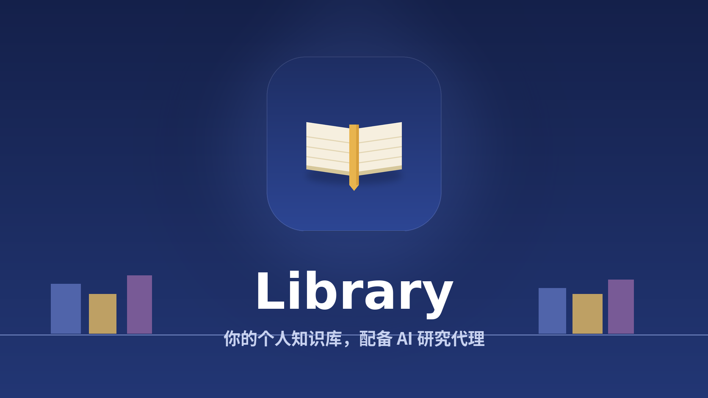

# Library

> English: [README.md](README.md)
> 设计文档: [DESIGN.md](DESIGN.md)
> GUI 教程: [中文](docs/GUI_TUTORIAL.zh-CN.md) · [English](docs/GUI_TUTORIAL.md)

**把你的 PDF、笔记、表格、日志和压缩包变成一个能读原文、会引用来源的私人
AI 图书馆。**

Library 是本地优先的个人研究 agent。它把杂乱的私有文件整理成一个可
检索、可追溯的知识库:文件仍然放在普通文件夹里,AI 负责编目、打标签、
建立关联;你提问时,agent 会先找材料,再读原文片段,最后给出带引用的回答。

[GUI 教程](docs/GUI_TUTORIAL.zh-CN.md) · [CLI 快速开始](#cli-快速开始) · [使用手册](USAGE.zh-CN.md) ·
[设计文档](DESIGN.md)



## 适合谁

- 你有很多 PDF、笔记、Office 文档、图片、表格、日志和压缩包,但它们分散
  在不同文件夹里。
- 你不想再把所有东西切块后丢进一个黑盒向量库,而是希望答案能回到原文。
- 你需要既能快速查找,也能做更慢但更完整的溯源式研究报告。
- 你想让本地文件保持可读、可备份、可迁移,而不是被锁进某个云端系统。

## 它能做什么

- 入库 text、Markdown、PDF、DOCX、图片、表格、日志和常见压缩包。
- 用文件夹、catalog、tag、view、metadata、journal 和关系挖掘组织材料。
- 默认走词法召回;需要时可开启 embedding、`sqlite-vec`、rerank 和证据配额。
- 回答前读取原文的章节、页码、段落、行号、压缩包成员或表格切片。
- 输出带引用的回答和报告,并把每轮调查写回 journal,供后续问题复用。

## 立即试用

### Web GUI

浏览器 GUI 位于 `frontend/`。开发模式下先启动后端，再启动 Vite 开发服务器:

```bash
library serve            # 后端(任务 runner 默认内置在进程中运行)
cd frontend
npm install
npm run dev              # 打开 http://localhost:5173
```

如需连接远程后端，可在 Settings 页设置 API base URL；默认配置下 Vite 会把
`/v1` 和 `/health` 代理到 `http://127.0.0.1:8000`。

### CLI 快速开始

```bash
python -m venv .venv

# Windows PowerShell
.\.venv\Scripts\Activate.ps1

# macOS / Linux
source .venv/bin/activate

pip install -e ".[dev]"
library init
```

编辑 `.env`:

```ini
LIBRARY_API_HOST=127.0.0.1
LIBRARY_API_PORT=8000
LLM_DEFAULT_PROVIDER=openai
LLM_DEFAULT_API_KEY=sk-...
LLM_DEFAULT_MODEL=gpt-4o-mini
```

启动内嵌 CLI + API + worker:

```bash
library
```

然后:

```text
library> /upload paper.pdf /
library> 比较一下 raft 和 paxos
```

`library` 命令是单进程——server / worker / CLI 全在里面,不需要开
第二个终端。第一次启动会自动初始化数据库 schema,不需要手动跑 migration。
托管部署可在发布前执行 `library-db-prepare`，然后为 API 和 worker 都设置
`RUNTIME_SCHEMA_BOOTSTRAP_ENABLED=false`，避免副本启动时并发执行 DDL。

如果希望 Web GUI、CLI、MCP、通过 skill 驱动的自动化或外部 HTTP 客户端共用
同一个后端,启动可复用的 HTTP 后端:

```bash
library serve
```

`library serve` 会读取 `.env` 里的 `LIBRARY_API_HOST` 和
`LIBRARY_API_PORT`,并把当前实际 URL 写到
`LIBRARY_HOME/runtime/server.json`。Web GUI 和 CLI 会自动发现这个文件;
skill 只要调用 `library` CLI,也会继承这套发现逻辑。显式传入
`--server URL` 或设置 `LIBRARY_SERVER` 时仍然优先使用显式配置。

默认你的文件以真实文件夹形式存在 `~/LibraryData/library/...` 下。可以
在 Finder 里浏览、用 `rsync` / `git` 备份、用任何编辑器修改——库就是
你的文件夹,library 只负责索引。在 library 之外改了文件后,跑
`/check` 看 diff,`/ingest --all` 同步。

`LIBRARY_HOME=/some/path` 把整个目录(db + library + cache)挪到
任意位置。

## 可以这样问

```text
比较一下这篇 Raft 论文和我的 Paxos 笔记。
从日志和复盘文档里整理事故时间线。
哪些上传的论文支持这个结论,哪些反对?
总结这个表格,并标出结论用到了哪些行。
把这个文件夹整理成一份带引用的研究简报。
```

## 和普通 RAG 的区别

Library 不只是“取 top-k chunk 然后回答”。它会先用 journal、文件夹、
catalog、tag、view、metadata 和 `recall_knowledge` 缩小范围,再按需合并
词法召回、可选 embedding 召回、RRF 风格打分、可选 rerank 和 evidence 配额。
最后 agent 会读取原文窗口,而不是只依赖预切 chunk。

短问题可以走**快速**模式;需要覆盖率和交叉验证的问题可以走**深入**模式,
保留完整 ReAct 调查循环。

## 它怎么工作

三个角色分工:

- **图书馆员**: 离线批处理。入册新文件、归并同义 tag、重整 catalog。
- **调查员**: 在线 agent。Plan -> 工具调用 -> 读原文 -> 带引用的答案。
- **你**: 上传、整理文件夹、归档、删除。库是你的;AI 的工作产物独立存放。

调查员的笔记本是真的一张表(`journal`),图书馆员后续重整时会读它。这个
反馈回路让库越用越懂你的材料。

## CLI

`library` 是 Claude-Code 风格的 REPL。`/` 开头是 slash 命令,其他
内容直接发给 agent。

不带参数的 `library` 会进入交互式 REPL。同一套能力也提供 one-shot
子命令,方便脚本、CI、skill 或不使用 MCP 的 agent 调用:

```bash
library ask "比较这篇 Raft 论文和我的 Paxos 笔记"
library search "raft consensus" --json
library info <entry_id> --json
library discover <entry_id> --top-k 12 --json
library check --json
library ingest --all --yes --json
library reprocess failed --json
```

one-shot 命令和 REPL 使用同一套后端发现模型:显式 `--server URL`,然后是
`LIBRARY_SERVER`,再读取 `LIBRARY_HOME/runtime/server.json`,最后回退到
embedded backend。默认文本输出给人看;`--json` 会让 stdout 保持结构化,便于自动化解析。

```
/help                           列出所有命令
/upload <local> <remote>        从外部拷文件进库
/check                          对比磁盘和 db(只读)
/ingest <vault_path>            同步单个文件
/ingest --all                   同步整个库
/reprocess failed               重跑所有 failed 文件
/reprocess folder <id> failed   只重跑某个文件夹子树里的 failed 文件
/discover <entry_id> [N]        查看语料库为它链接到的 entry
/discover <entry_id> --all      包含未 vetted 的 raw relation signal
/discover <entry_id> --vet      为该 entry 的直连 raw signal 排后台 vet
/tree                           文件夹树
/ls [parent_id]                 列文件夹
/cd <path>                      切换"远端 cwd"(用于相对路径上传)
/search <query>                 按文件名 + summary 召回
/info <entry_id>                查看 entry 的用户可见 metadata + summary
/download <entry_id|folder_id>  文件 → 字节;文件夹 → zip
/export [<conv_id>]             把对话 + 引用打包成 zip
/mode [auto|quick|deep]         查看或切换 chat 模式
/clear  /  /new                 结束 / 开始 chat session
/quit
```

默认 `auto` 会让 planner 用纯文本 `BUDGET:` 控制线选择 quick/standard/deep
预算，并在工具仍产出新证据时自动升级；`/mode quick` 和 `/mode deep` 仍保留为
手动强制模式。

## MCP Server

也可以把 Library 作为 stdio MCP server 暴露给 Claude Desktop 或其他
支持 MCP 的 agent:

```bash
library mcp
# 或
library-mcp
```

MCP server 使用和 CLI 相同的后端发现模型:显式 `--server URL`,然后是
`LIBRARY_SERVER`,再读取 `LIBRARY_HOME/runtime/server.json`,如果没有
正在运行的后端,最后启动 embedded backend。MCP 客户端配置里使用和 CLI
相同的 `LIBRARY_HOME`、数据库、存储以及可选 provider 环境变量即可。

MCP 会暴露结构化 workflow tools,包括 `ask_library`、`upload_file`、
`download_file`、`download_folder`、`export_conversation`、`search_files`、
`get_file_metadata`,以及检索/读取工具 `recall_knowledge`、
`search_metadata`、`search_journal`、`read_entries_metadata` 和
`read_files`。

一次对话 turn 渲染成事件流:

```
library> 比较一下 raft 和 paxos
⠋ planning the investigation...
⠋ calling recall_knowledge(text=["raft", "paxos"])
⠋ calling read_files(entry_id=...)
⠋ investigator thinking...
✓ answer ready

# Raft vs Paxos
Raft 把 Paxos 拆成三个相对独立的子问题……
[^a]: entry_id=...

  [tokens in=3300 out=340 tools=2 llm_calls=3 4521ms]
```

## 架构

**14 张表,4 层**:

```
audit_events                — 事件流(90 天滚动)
sessions / conversations    — 容器 + 累计指标
catalogs / views / tags /   — AI 内部:图书馆员的工作知识
  tag_aliases / entry_tags /  (用户看不到这层)
  entry_relations / journal
folders / file_entries /    — 用户可见
  files
tasks / task_outcomes       — 基础设施
```

**任务队列 + ReAct 工具 + 8 条 ingest pipeline**:

- text / pdf(含扫描件 OCR via VLM)/ image(VLM 缩放)
- docx / spreadsheet / log(含 logrotate 变种)
- archive(zip / tar.* / 7z / rar / .gz / .bz2 / .xz / iso / cab,50+ 种 via py7zz)

### 混合召回

调查员现在优先用 `recall_knowledge` 做宽召回:

```
用户问题
  → recall_knowledge
      → resolve_tag
      → search_journal
      → search_metadata(tags/text)
      → 可选 semantic recall
      → RRF 风格合并打分
      → 可选 rerank
      → quota 或 rerank evidence selection
  → read_entries_metadata
  → read_files
  → 带引用答案
```

embedding 和 rerank 都是可选能力,不会隐式复用 chat / vision / ingest 的
API key。默认 embedding 配置面向百炼/DashScope 的 `text-embedding-v4`;
如果安装 `sqlite-vec`,semantic index 会额外写入 `vectors.sqlite`,否则走文件
索引 fallback。当前公开 CLI 的 semantic index 构建命令主要服务 eval 数据集;
普通库可在 GUI/API 中排队重建默认 semantic index,用于更换 embedding 模型或
维度后的全量重嵌入。ingest 成功后也会在 semantic recall 已配置时刷新该文件的
semantic 向量。
全库重建通过 `SEMANTIC_REBUILD_PAGE_SIZE` 分页读取数据库；词法候选如果缺少
章节定位，会在 `SECTION_BACKFILL_MIN_SCORE` 阈值以上回填限定在该文件内的
最佳语义章节，不会因此扩大候选集合。
按内容去重的上传不会复活已经软删除的文件行。重复上传未完成或失败内容时会
恢复 ingest；重复上传已就绪内容时会排单文件 semantic 刷新。只有 provider、
model、维度和章节文本 hash 都与当前 embedding 配置一致时，刷新才会复用旧向量。

每个 LLM profile 都可以显式声明请求方言、上下文窗口、tokenizer、图片/工具/
temperature 能力和输出 token 参数名，设置界面也可编辑这些字段；运行时不再
根据网关 URL 猜测方言。超过模型窗口的会话请求会按 token 压缩为结构化
checkpoint，但数据库中的原始 turn 不变；`CONVERSATION_COMPACTION_*` 与证据
压缩完全独立。会话指标还会按 `AGENT_CACHE_SLO_*` 阈值输出缓存 SLO 的
`met`、`breached` 或 `insufficient_data` 三态结果。

metadata 文本检索在 SQLite 和 Postgres 两种部署形态下都有索引:SQLite 使用
FTS5 trigram 表;Postgres 使用 `to_tsvector` / `websearch_to_tsquery`
表达式 GIN 索引。中文双字词这类短 CJK 查询不会再被 trigram 路径静默丢弃,
混合查询里会用有界 LIKE fallback 补回。

journal 召回会在读取时校验引用 entry:如果旧笔记指向已删除 entry,或源文件
在笔记写入后重新 ingest,笔记仍保留用于审计,但会标记为 stale 并排在当前
有效笔记之后。后续 reflect 如果发现同一 entry 的旧 journal 结论被直接矛盾,
会把旧行标记为 invalidated;默认活跃召回会隐藏它,审计查询仍可显式包含。

### 评测结论

最新本地 SciFact 评测支持这个方向,但不把它包装成通用 SOTA:

- `library eval ablation-run` 可以输出 retrieval 组件消融矩阵,
  对比 metadata-only、relations、semantic recall、rerank 和 full recall
  的候选池指标差异。
- `library eval load-run` 可执行有界并发检索压测，输出请求速率、错误率、
  p50/p95/p99、Hit@K 和 MRR，并可用阈值让不达标的运行返回非零退出码。
- 300 条 retrieval,`recall_knowledge` + rerank top-80: MRR 0.7226,
  hit@10 0.8800,hit@100 0.9133。
- 300 条 bounded answer-run,rerank top-80 + quota: evidence hit 0.8667,
  citation hit 0.7133,label accuracy 0.8085。
- 30 条端到端报告对比:ReAct 赢 26 条,one-shot RAG 赢 2 条,平 2 条,
  timeout 1 条。

结论是:Library 可以宣传为“个人图书馆研究报告场景很强”,尤其适合需要
溯源、引用和多步调查的问题;但完整 ReAct 流程有更高延迟和模型调用成本。

### Discovery(减少 agent 循环次数)

调查员一旦找到一个相关 entry,discovery 层立即把可能的邻居塞给它——
下一步不需要再烧一轮 search + read_files。三个 miner 先写廉价 raw signal;
`/discover` 默认只读已经缓存的 vetted 图,不会在普通浏览时触发 LLM。
需要判断该 seed 的直连 raw signal 时,显式运行 `/discover <entry_id> --vet`;
它只排后台任务,当前响应仍然是纯读结果。

```
mine_session_cooccurrence    journal 里 X 和 Y 在同一对话中被提及
mine_tag_overlap             Jaccard ≥ 0.30 且共享 ≥ 2 个 tag
mine_citation_graph          X 和 Y 在同一 agent 答案中被同时引用
                ↓
       entry_relations(原始,带 source_kind)
                ↓
   /discover --vet 排后台 vet  LLM 关卡,逐对判断 → vetted=True/False
                ↓
       entry_relations.vetted=True(干净的图)
                ↓
   services.recommend.find_related   带重启的 random walk,alpha=0.15
                ↓
   /discover <entry_id>            CLI 入口
   search/get_metadata.related_entries   预填 top-3 / top-8
```

Miner 由 periodic dispatcher 驱动。批量 `vet_relations` 默认关闭;如需提前
批量判断关系,设置 `RELATION_BACKGROUND_VETTING_ENABLED=true` 或手动运行 `/tend`。
临时只判断某个 seed 的直连关系,用 `/discover <entry_id> --vet`。

完整设计见 [`DESIGN.md`](DESIGN.md)。

## API

业务 endpoint 全在 `/v1/`:

```
POST /v1/upload                        上传文件
GET  /v1/folders                       文件夹树
GET  /v1/file-entries/{id}/...         单文件操作
GET  /v1/search                        metadata 召回
POST /v1/sessions                      开 chat session
POST /v1/chat/{session_id}             chat(SSE 流)
GET  /v1/conversations/{id}/events     按 SSE 游标续播
POST /v1/conversations/{id}/cancel     主动停止后台 turn
POST /v1/sessions/{id}/close
GET  /v1/conversations/{id}/export     导出对话 zip
GET  /health                           liveness probe(无版本)
GET  /live                             仅进程存活
GET  /ready                            数据库与存储就绪探针
```

`POST /v1/chat/{session_id}` 返回 `text/event-stream`。事件:
`conversation` / `planning` / `plan` / `thinking` / `tool_call` /
`tool_result` / `answer` / `error` / `done`。CLI 状态机就是按这些事件
渲染的。

请求体支持 `{ "query": "...", "mode": "deep" }` 或
`{ "query": "...", "mode": "quick" }`;省略 `mode` 时默认走 `auto`,
由 planner 选择预算档位。

## 配置

`.env`:

```ini
LIBRARY_HOME=~/LibraryData     # 一个根目录;db + library + objects 都在这下面
DB_BACKEND=sqlite                # 或 postgres
RUNTIME_SCHEMA_BOOTSTRAP_ENABLED=true # 托管迁移完成后可设为 false

STORAGE_BACKEND=mirror           # 默认。文件以可读文件夹形式存:
                                 #   <home>/library/research/llm/paper.pdf
                                 # 备选:'local'(UUID 扁平,dedup,
                                 # 高频改写场景快约 5 倍)/ 's3'

WORKER_ENABLED=true              # embedded 模式默认开
WORKER_SCHEDULER_ENABLED=true    # false 时仍处理普通任务,但不运行周期调度
WORKER_RETRY_BASE_SECONDS=60      # 任务重试指数退避起点
WORKER_RETRY_MAX_SECONDS=3600     # 任务重试退避上限
LIBRARY_UPLOAD_MAX_BYTES=0     # 单文件上传上限;0 = 不限制
LIBRARY_DOCUMENT_LIMIT=0          # 全局可选容量门禁;0 = 关闭
LIBRARY_STORAGE_BYTES_LIMIT=0
INGEST_BACKLOG_LIMIT=0
CHAT_CONCURRENCY_LIMIT=0
MAINTENANCE_DAILY_TOKEN_BUDGET=0 # 后台维护 24 小时滚动 token 上限;0 = 不限制
RELATION_BACKGROUND_VETTING_ENABLED=false

LLM_DEFAULT_PROVIDER=openai      # openai / openai-compatible / anthropic
LLM_DEFAULT_API_KEY=sk-...
LLM_DEFAULT_BASE_URL=
LLM_DEFAULT_MODEL=gpt-4o-mini
LLM_REFLECT_MODEL=gpt-4o
LLM_VISION_MODEL=gpt-4o

EMBEDDING_API_KEY=
EMBEDDING_BASE_URL=https://dashscope.aliyuncs.com/compatible-mode/v1
EMBEDDING_MODEL=text-embedding-v4
SEMANTIC_RECALL_ENABLED=false
SEMANTIC_INDEX_BACKEND=auto      # auto / file / sqlite-vec
SECTION_EMBEDDING_MAX_SECTIONS=200 # 0 = 仅保留文档级向量

RERANK_ENABLED=false
RERANK_API_KEY=
RERANK_BASE_URL=https://dashscope.aliyuncs.com/compatible-api/v1
RERANK_MODEL=qwen3-rerank
EVIDENCE_SELECTION=quota         # quota / rerank

AGENT_PLAN_MAX_TOKENS=2048
AGENT_EXECUTE_MAX_TOKENS=4096
AGENT_MAX_PARALLEL_TOOL_CALLS=8
AGENT_FINAL_ANSWER_CONTINUE_TURNS=3
AGENT_FINAL_ANSWER_MAX_CHARS=120000

LLM_INGEST_MAX_TOKENS=1200
LLM_INGEST_CONCURRENCY=4
LLM_VISION_SUPPORTS_VISION=true

LIBRARY_SERVER=               # 非空 = 远程模式,跳过 embedded
```

OpenAI 兼容 endpoint(Together / Groq / DeepSeek / 本地 vLLM / ollama)
通过 `LLM_*_BASE_URL` 切换。

`MAINTENANCE_DAILY_TOKEN_BUDGET` 只限制后台维护 LLM 用量。预算耗尽时,
`restructure_catalogs`、`vet_relations`、`propose_views` 会延后到后续 tick;
上传 ingest 与对话 reflect 不受这个预算限制。

关系发现默认纯读:`/discover` 只读已经 vetted 的图,不会在请求里调用 LLM。
如需为某个 seed 判断直连 raw signal,运行 `/discover <entry_id> --vet`;
如需后台提前批量 vet,设置 `RELATION_BACKGROUND_VETTING_ENABLED=true`。

长调研答案如果在最终回答阶段撞到模型 token 上限,运行时会在服务端续写,
GUI 仍然只收到一个合并后的 `answer` 事件。可用
`AGENT_FINAL_ANSWER_CONTINUE_TURNS` 和 `AGENT_FINAL_ANSWER_MAX_CHARS`
调节续写轮数与最终答案字符上限。

每个对话事件会先写入持久事件表再交付。SSE 使用单调 `id` 游标，Web GUI 与 CLI
会从最后游标自动续播；`GET /v1/conversations/{id}/events` 也支持
`Last-Event-ID`。断开查看连接不会取消后台 turn，只有显式 cancel 才会终止并
持久化终态错误事件。

### 可靠性与恢复边界

每次任务领取都会生成独立 delivery owner token。心跳、完成、重试和过期 lease
恢复都必须同时匹配 owner 与预期 lease，因此旧 worker 在任务被其他 worker
接管后不能再提交结果或重试；owner 丢失时，本进程中的旧 handler 也会取消。
任务退避在 `WORKER_RETRY_BASE_SECONDS` 与 `WORKER_RETRY_MAX_SECONDS` 之间
指数增长；periodic dispatcher 使用时间槽去重键，当前 tick 不会再吞掉自己的
继任 tick。数据库启动升级时，会先把旧库中重复的 active dedup 任务收敛为最可
执行的一条，再安装唯一约束，无需手工修库。
队列专用 worker 可设 `WORKER_SCHEDULER_ENABLED=false`：普通任务照常处理，
但不会创建或领取 `periodic_tick`。
保留期清理会分批删除审计记录、终态任务投递记录、task outcome 和持久聊天事件；
pending/running 任务不会进入清理范围。

`LIBRARY_UPLOAD_MAX_BYTES` 在 multipart 数据流入时、Starlette spool 之前
生效；文件字节精确计数，表单 metadata 另有独立上限。上传提交结果不明确时会
执行补偿清理，本地 `.part` 会删除，失败的 S3 multipart 会 abort；物理对象删除
由可重试的持久任务表达。PostgreSQL 部署还会用 transaction advisory lock
串行化冲突工具作用域、并发 turn 和容量 check-and-create。使用 transaction
pooling 代理时应设置 `POSTGRES_PREPARED_STATEMENT_CACHE_SIZE=0`，此时 asyncpg
使用唯一 prepared statement 名称。`/live` 只检查进程，`/ready` 会并发检查
数据库和存储，任一依赖超时或失败即返回 503。
本地安装保持 `RUNTIME_SCHEMA_BOOTSTRAP_ENABLED=true` 即可；托管部署可先
统一执行 `library-db-prepare`，再设为 false，使 API/worker 副本启动不碰 DDL。

有意不支持的服务运行时能力仅限于必须更换数据模型的部分：组织/用户与
ACL/RLS 多租户隔离、共享知识库 slug、provider attempt envelope 表，以及外部
job queue 数据库对账。本项目保留单知识库 ownership，持久 chat 交付和自己的
`tasks` 队列都在这一模型内完成。

## 部署形态

**默认(embedded)**:`library` 在自己进程里挂 FastAPI + TaskRunner。
HTTP 不经过 socket——`httpx.ASGITransport` 直接调 ASGI app。99% 场景
应该用这个。

```
   ┌──────────────────────────────────────┐
   │  library  (CLI + ASGI + worker)   │
   └──────────────────────────────────────┘
```

**多机部署**(可选):server 拆成独立进程,CLI 通过 HTTP 连。SQLite
同时只允许一个写进程——多机部署用 Postgres。

```
   ┌─────────────┐         ┌──────────────────┐
   │  library │   HTTP  │  uvicorn server  │
   │     CLI     ├────────►│  library.main │  (WORKER_ENABLED=true)
   └─────────────┘         └────────┬─────────┘
                                    │  共享 Postgres + storage
```

```bash
library serve --host 0.0.0.0 --port 8000
library --server http://server.lan:8000
# 如果 server 设置了 LIBRARY_API_TOKEN:
library --server http://server.lan:8000 --api-token "$LIBRARY_API_TOKEN"
# 或写入持久配置: LIBRARY_SERVER=http://server.lan:8000 -> ~/.library/.env
```

### 多设备同步

不要用 Dropbox、Syncthing、iCloud Drive、OneDrive 等文件同步工具同步正在
运行的 `LIBRARY_HOME`。SQLite 和 mirror/local 存储在并发复制下可能损坏。
多设备共享请使用 Postgres + S3 兼容对象存储的 remote 部署形态。

### WebDAV 知识库快照

v0.3.0 起 Library 支持 WebDAV knowledge-pack 同步。它不会同步运行中的
SQLite、cache、runtime 或任务队列，而是把当前知识库导出成可验证快照:

```text
latest.json
snapshots/<snapshot_id>/manifest.json
snapshots/<snapshot_id>/entries.jsonl
snapshots/<snapshot_id>/folders.jsonl
snapshots/<snapshot_id>/tags.jsonl
blobs/sha256/<prefix>/<sha256>
```

在 Settings -> WebDAV sync 中配置 URL、用户名、密码和远端路径。Library 左侧
工具栏的云按钮会发布本机快照到 WebDAV。另一台设备可在 Settings 里 Pull
metadata,先导入文件名、摘要、标签、catalog 和关系;这些条目会出现在 Library
中,但原始文件还未下载。打开远端条目时可按 sha256 从 WebDAV hydrate 到本地,
完成后再预览、下载或引用原文。

## 文档

- [USAGE.zh-CN.md](USAGE.zh-CN.md): 使用和运维手册。
- [DESIGN.md](DESIGN.md): 数据模型、检索设计、任务系统和关键不变量。
- [docs/LAUNCH.md](docs/LAUNCH.md): 宣传文案、social preview 和社区发帖模板。

## 开发

```bash
uv run ruff check src tests
.venv/Scripts/python tests/test_agent_e2e.py
for t in tests/test_*_e2e.py; do .venv/Scripts/python "$t"; done
```

测试覆盖 upload / ingest / reflect / dispatcher / lifecycle / restructure /
agent runtime / agent tools / CLI / image / pdf / pdf-OCR / docx /
spreadsheet / container / git / archive pipeline / mirror 存储 /
scan + sync / discovery / semantic index fallback / recall-rerank scoring /
eval 命令等路径。

## License

Copyright (c) 2026 weifu1997

MIT。完整条款见 [LICENSE](LICENSE)。
